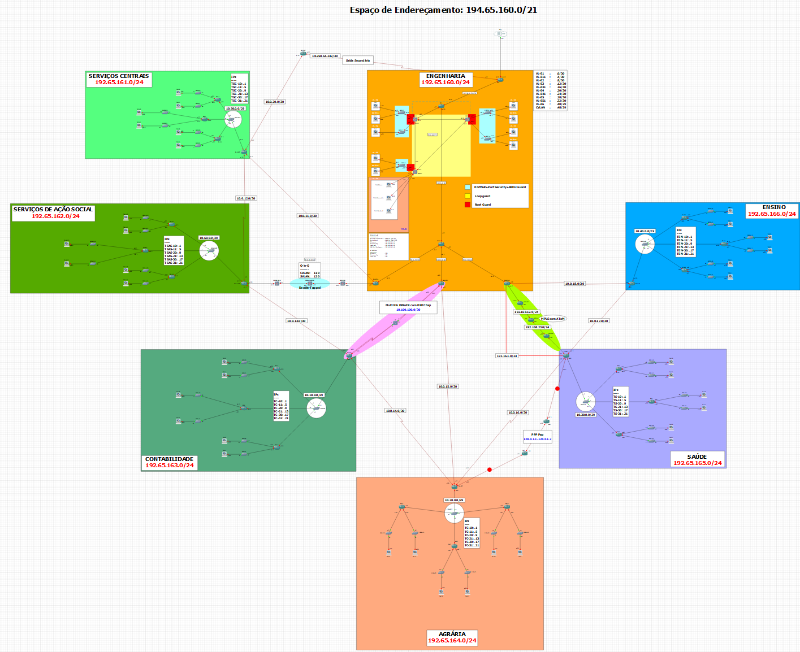

# Multi-Layer-Network

## 📌 Overview

**Multi-Layer-Network** is a simulated enterprise-grade infrastructure designed to integrate both Layer 2 and Layer 3 technologies. The network spans multiple branches (Engineering, Health, Agriculture, etc.), each connected through routing protocols and VLAN segmentation.

This project reflects a real-world campus network with full subnetting, security mechanisms, and service deployments. It showcases protocol integration (RIP, OSPF), switching concepts, and end-to-end connectivity.

---

## Key Concepts & Technologies

- **Layer 2 (Switching):**
  - VLANs, PVLANs
  - RSTP
  - VTP (Transparent and Server Modes)
  - Port Security
  - BPDU Guard / Filter
  - Root Guard / Loop Guard

- **Layer 3 (Routing):**
  - RIP (main routing protocol)
  - OSPF (for MPLS AToM simulation)
  - Static routes for service support
  - Multilink PPP over Frame Relay

- **Security & Access Control:**
  - ACLs
  - SSH access on L3 switches and routers
  - PPP PAP/CHAP authentication

- **Services:**
  - NAT
  - DHCP
  - Subnetting for all branches
  - Internet Simulation via RE-1 router

---

## Branches & Subnets

| Department             | Subnet               | CIDR  |
|------------------------|----------------------|--------|
| Engineering            | 194.65.160.0         | /24   |
| Accounting             | 194.65.161.0         | /24   |
| Agrarian               | 194.65.162.0         | /24   |
| Health                 | 194.65.163.0         | /24   |
| Education              | 194.65.164.0         | /24   |
| Central Services       | 194.65.165.0         | /24   |
| Social Action Services | 194.65.166.0         | /24   |

---

## Equipment Emulated

- **Routers:** `i86bi-linux-l3-adventerprisek9-15.4.1T.bin`
- **Switches (L2 & L3):** `i86bi-linux-l2-adventerprisek9-ms.SSA.high_iron_20190423`

---

## Implementation Notes

- Layer 3 switches are used as root bridges in a segmented fashion for better load balancing.
- PPP PAP was implemented between intermediary routers due to simulator limitations.
- MPLS AToM is configured but not functional due to limitations in reachability beyond RE-1.
- Full ping connectivity inside the topology was tested successfully.

---

## 📄 Author

**Lucas Ribeiro Caetano**
GitHub: [@lucasrcaetano](https://github.com/LucasRibeiroCaetano)
